# Pharmacy Management System
## Major Project Report

**Project Title:** Smart Pharmacy Management System with AI-Based Demand Forecasting  
**Domain:** Healthcare Informatics / Retail Pharmacy Automation  
**Technology Stack:** FastAPI, MongoDB, React, Vite, Tailwind CSS, Docker, Scikit-learn  
**Date:** 11 March 2026

---

## ABSTRACT

The Pharmacy Management System is a full-stack, data-driven software platform designed to modernize pharmacy operations across medicine inventory control, billing and invoicing, customer relationship management, supplier and purchase order workflows, real-time alerting, and AI-supported demand prediction. Traditional pharmacy operations often rely on disconnected spreadsheets, manual stock books, and ad hoc billing systems, leading to recurrent errors in stock counting, delayed replenishment, expired item wastage, and weak business visibility. This project addresses those operational gaps through a modular, web-based architecture that combines robust transactional workflows with analytics and forecasting capabilities.

At the backend, the platform is built using FastAPI to provide structured REST APIs with asynchronous I/O and strong input validation via Pydantic models. MongoDB acts as the data persistence layer, allowing flexible schema evolution while preserving high write throughput for frequent transactional updates such as sales, billing records, and notification generation. The frontend is built in React with Tailwind CSS for responsive and role-friendly interfaces. The system also includes a machine learning service that applies linear regression over historical sales timelines to estimate near-term medicine demand and assist purchasing decisions.

The system supports the complete pharmacy life cycle: user authentication, medicine CRUD, stock monitoring, customer management, billing with GST calculations, sales tracking, supplier records, purchase order creation and lifecycle control, notification center, and multi-view reports. It integrates business rules such as reorder-level checks, expiry tracking, stock reduction during sales/billing, stock restoration for bill deletion, and purchase-order-based inventory increases after goods receipt. The alerting pipeline automatically identifies low stock, out-of-stock, expired, and soon-to-expire medicines, improving preventive action and reducing inventory risk.

A key innovation of the project is the operational integration between inventory and demand intelligence. Instead of treating prediction as a separate dashboard artifact, this system positions demand forecasts as decision support for procurement and safety-stock planning. Generated predictions include confidence indicators and reorder recommendations, enabling pharmacy managers to balance service availability and capital lock-in.

From a software engineering perspective, the project demonstrates layered design, route-level modularity, reusable client API abstraction, and containerized deployment for reproducible setups. It can run through Docker Compose with a single command, reducing onboarding complexity for academic demos and production pilots. The architecture is extensible for enterprise hardening, including JWT-based auth, RBAC enforcement, audit logging, and advanced forecasting models.

In summary, this project is a practical and scalable digital transformation solution for pharmacy operations. It contributes both immediate operational benefits and a future-ready foundation for intelligent healthcare retail automation.

---

## ACKNOWLEDGEMENT

This project was completed with the support of mentors, peers, and open-source communities whose guidance significantly improved both technical quality and documentation depth.

Sincere gratitude is extended to the project guide and academic faculty for their continuous feedback on system design decisions, documentation standards, and implementation methodology. Their review cycles helped shape this work from a simple inventory application into an integrated pharmacy operations platform.

Special thanks are due to colleagues and testers who contributed practical pharmacy workflow insights, especially in billing, supplier communications, and stock handling edge cases. Their scenario-based inputs were essential for validating usability and business realism.

Appreciation is also expressed to the maintainers of FastAPI, React, MongoDB, Tailwind CSS, and Scikit-learn, whose open documentation and ecosystem tooling enabled accelerated development and clear architecture choices.

Finally, gratitude is offered to all contributors who helped in review, refinement, and validation of this report.

---

## LIST OF FIGURES

1. Figure 1.1: High-Level Problem Context and System Goal
2. Figure 1.2: Documentation Structure Map
3. Figure 2.1: Literature Taxonomy in Pharmacy Informatics
4. Figure 3.1: Functional Requirement Dependency Graph
5. Figure 4.1: Overall System Architecture
6. Figure 4.2: Backend Module Layering
7. Figure 4.3: Database Entity Relationship Overview
8. Figure 4.4: Authentication and Request Flow
9. Figure 4.5: Billing and Stock Synchronization Flow
10. Figure 4.6: Purchase Order Lifecycle State Diagram
11. Figure 4.7: Notification Generation Pipeline
12. Figure 4.8: AI Prediction Pipeline
13. Figure 5.1: Development Methodology Timeline
14. Figure 5.2: Frontend Navigation and Component Hierarchy
15. Figure 5.3: API Route Map
16. Figure 6.1: Dashboard KPI Interpretation Map
17. Figure 6.2: Sample Sales Trend Representation
18. Figure 7.1: Experimental Setup and Environment Matrix
19. Figure 7.2: Test Strategy and Coverage Layers
20. Figure 8.1: Future Roadmap Progression

---

# 1. INTRODUCTION

Digital transformation in healthcare retail is no longer optional. Pharmacies handle high-frequency, high-risk transactions where accuracy, timeliness, and compliance are essential. Even small operational mistakes such as wrong stock counts, delayed refill decisions, billing mismatches, and expiry negligence can affect both patient outcomes and business sustainability. The Pharmacy Management System presented in this report is designed as an integrated response to these challenges.

## 1.1 Overview

The project is a web-based platform that unifies core pharmacy operations under a single transactional and analytical framework. It includes:

- User authentication and session management
- Medicine inventory lifecycle management
- Sales recording and billing workflows
- Customer profile and purchase tracking
- Supplier management and purchase orders
- Automated notifications and alerts
- Demand prediction using machine learning
- Operational and financial reports

The system is implemented as a frontend-backend architecture:

- Frontend: React-based responsive interface for pharmacists, cashiers, and administrators
- Backend: FastAPI REST services with asynchronous MongoDB access
- Data Layer: MongoDB document collections for transactional and master records
- Support Services: Prediction engine and notification generator

### Figure 1.1: High-Level Problem Context and System Goal

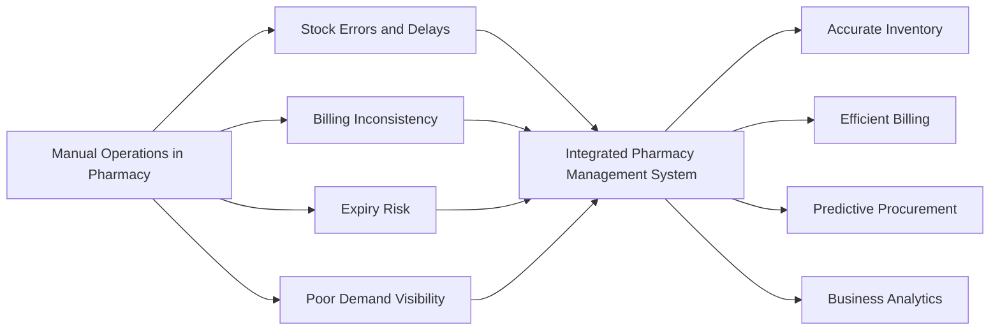

**Explanation:** This figure shows how fragmented manual operations produce recurring business risks and how an integrated information system mitigates those risks through structured workflows.

## 1.2 Problem statement

Most small and medium pharmacies operate with fragmented tools that are not designed for end-to-end process synchronization. Key pain points include:

- No real-time synchronization between billing and stock updates
- Delayed recognition of low stock and expiry conditions
- Absence of demand forecasting for proactive procurement
- Limited ability to trace supplier performance and purchase cycles
- Lack of consolidated reports for business decisions

These limitations lead to either stock-outs (lost sales and patient dissatisfaction) or overstocking (capital lock and expiry losses). The problem is therefore not only transactional but also strategic: pharmacies need systems that convert daily operations into decision-ready intelligence.

## 1.3 Importance of work

The significance of this project spans technical, operational, and social dimensions:

- It reduces medicine unavailability through better stock intelligence
- It minimizes wastage through expiry-aware monitoring
- It improves billing consistency and tax-ready invoice data
- It provides management visibility through actionable dashboards
- It enables scalable growth with modular architecture

In education and industry contexts, this system demonstrates how software engineering and data analytics can combine to solve a real healthcare retail problem.

## 1.4 Objectives

Primary objectives of the project are:

1. Build a complete pharmacy operations platform with modular backend APIs and responsive frontend interfaces.
2. Ensure accurate stock control through transaction-linked inventory updates.
3. Support billing workflows with tax-aware calculations and itemized bill records.
4. Provide customer and supplier management for relationship continuity.
5. Add purchase order lifecycle control and receiving workflows.
6. Generate alerts for low stock, out-of-stock, and expiry events.
7. Integrate demand forecasting using historical sales data.
8. Provide reports for operational, inventory, and customer analysis.

Secondary objectives include:

- Containerized deployment for easy setup
- Structured schema validation and error handling
- Extensibility for security and compliance upgrades

## 1.5 Social Impact

Pharmacy operations directly influence healthcare accessibility. A reliable management system can have substantial social value:

- Better medicine availability improves continuity of care
- Reduced manual errors improves patient trust and safety
- Faster billing reduces queue times and waiting stress
- Data-backed inventory control improves affordability by reducing wastage
- Scalable digital infrastructure supports neighborhood pharmacies and underserved areas

## 1.6 Challenges

During design and implementation, several technical and operational challenges were addressed:

- Maintaining consistency between sales/billing and stock quantities
- Handling date-sensitive logic for expiry and alerts
- Preventing duplicate notifications for repeated risk conditions
- Designing a simple but useful demand prediction model
- Managing route modularity while preserving shared business rules
- Keeping UI comprehensive yet usable for multi-role users

## 1.7 Limitations

Current project limitations include:

- Token management is in-memory and not suitable for distributed production deployments
- Authentication does not yet enforce strict route-level RBAC policies
- Password hashing should migrate from SHA256 to stronger adaptive algorithms
- Forecasting model is baseline linear regression and can be improved for seasonality
- No native offline-first mode for low-connectivity environments

## 1.8 Documentation Organization

This report follows a structured chapter flow from problem framing to implementation and outcomes.

### Figure 1.2: Documentation Structure Map

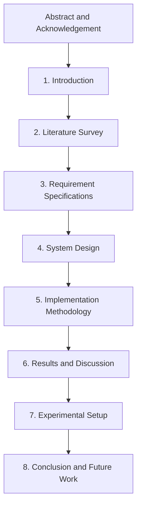

**Explanation:** The report structure progresses from conceptual foundation to validated outcomes and future extensions.

---

# 2. LITERATURE SURVEY

Pharmacy management software has evolved from billing-centric desktop applications to integrated cloud platforms with analytics, alerting, and forecasting features. The literature and product ecosystem reveal several recurring design priorities.

## 2.1 Evolution of Pharmacy Information Systems

Early systems focused mainly on:

- Invoice generation
- Item master maintenance
- Basic stock decrement rules

Modern systems increasingly support:

- Distributed inventory visibility
- Supplier integration
- Customer behavior analytics
- Replenishment recommendations
- API-first integration architecture

## 2.2 Survey Dimensions

The survey is analyzed across six dimensions:

1. Transactional Integrity  
2. Inventory Intelligence  
3. Analytics Readiness  
4. Security and Access Control  
5. Integration and Deployment  
6. User Experience and Adoption

### Figure 2.1: Literature Taxonomy in Pharmacy Informatics

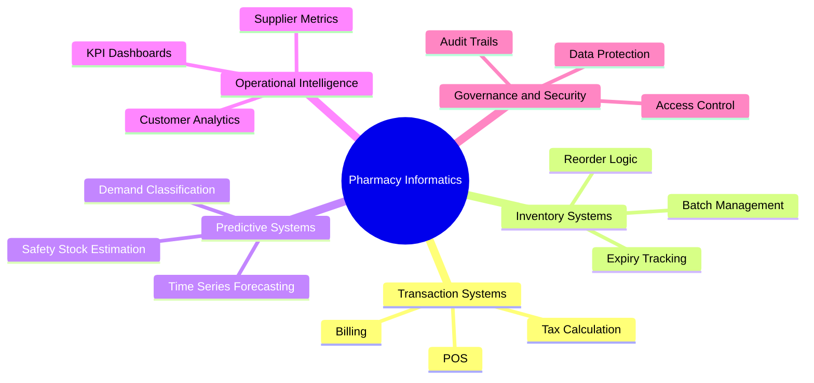

**Explanation:** Existing solutions usually solve one cluster effectively but often lack deep integration across all clusters.

## 2.3 Key Findings from Existing Approaches

### 2.3.1 Inventory-Centric Tools

Strengths:

- Good item tracking
- Basic reorder alerts

Gaps:

- Limited billing integration
- Weak supplier workflow support

### 2.3.2 Billing-Centric Tools

Strengths:

- Fast invoice generation
- Payment mode flexibility

Gaps:

- Poor long-term inventory planning
- Minimal forecasting and analytics

### 2.3.3 ERP-Scale Platforms

Strengths:

- End-to-end process control
- High configurability

Gaps:

- Complexity and cost barriers for small pharmacies
- Heavy deployment and training overhead

## 2.4 Research Gap

The major gap is a practical, lightweight, yet integrated system that combines:

- Day-to-day pharmacy transactions
- Risk-aware inventory monitoring
- Procurement workflows
- Basic AI support for demand planning

The present project is positioned to fill this gap with open technologies and modular architecture.

## 2.5 Comparative Insight Summary

| Dimension | Common Legacy Systems | Proposed System |
|---|---|---|
| Billing | Present | Present with GST and itemized structure |
| Inventory Alerts | Basic | Low-stock, out-of-stock, expiring, expired |
| Forecasting | Rare | Integrated demand prediction |
| Supplier + PO | Partial | Full PO lifecycle with receive updates |
| API-first Design | Limited | FastAPI modular routes |
| Container Deployment | Rare | Docker-based setup |

---

# 3. REQUIREMENT SPECIFICATIONS

This chapter presents functional and non-functional requirements, business constraints, and acceptance criteria.

## 3.1 Stakeholders

- Pharmacist: manages medicines, billing, and customer interactions
- Cashier: handles billing and sales records
- Administrator: oversees users, analytics, suppliers, and procurement
- Business owner: monitors financial and operational KPIs
- End customer: indirectly affected through service quality and medicine availability

## 3.2 Functional Requirements

### FR-01 Authentication

- User can sign up with email, username, password, full name, role.
- User can log in and receive token-based session.
- User can verify token validity.
- User can log out.

### FR-02 Medicine Inventory

- Add medicine with batch, quantity, price, expiry, category, reorder level.
- View all medicines.
- Update medicine details.
- Delete medicine record.
- View expiring medicines and available categories.

### FR-03 Sales Management

- Record sales with medicine linkage, quantity, price, total.
- Validate stock before sale.
- Update stock after sale.
- View all sales and summary metrics.

### FR-04 Customer Management

- Add, update, view, delete customers.
- Enforce unique phone rule.
- Maintain purchase summary fields.

### FR-05 Billing

- Create bill with multiple items.
- Compute subtotal, GST, grand total.
- Support payment modes.
- Fetch and delete bills.
- Restore stock upon bill deletion.

### FR-06 Supplier Management

- Create and update supplier records.
- Search and filter supplier list.
- Soft delete supplier if linked orders exist.
- View supplier purchase history.

### FR-07 Purchase Orders

- Create PO with supplier and medicine items.
- Track statuses (pending, ordered, delivered, cancelled).
- Approve, receive, cancel, update, delete PO under conditions.
- Update stock when items are received.

### FR-08 Notifications

- Generate alerts for low stock/out-of-stock/expiry.
- Mark individual or all notifications as read.
- Delete single or all notifications.
- Provide unread count and summary views.

### FR-09 Reports

- Generate sales reports by date and period.
- Generate inventory reports by category and status.
- Generate customer analytics by date range.

### FR-10 Demand Prediction

- Use historical sales data to forecast medicine demand.
- Display prediction confidence and recommendation.

## 3.3 Non-Functional Requirements

### Performance

- Typical read endpoints should respond within 500 ms in local setup under nominal load.
- Core write flows (billing, sale, PO receive) should remain within acceptable interaction latency.

### Reliability

- Business rules must prevent negative stock outcomes.
- Validation errors must return clear API responses.

### Usability

- Interface must be responsive and easy to navigate.
- Modules should be organized by operational tasks.

### Scalability

- Service decomposition by routes enables future scaling by module.
- MongoDB document model supports incremental schema growth.

### Security

- Password hashing, token checks, input validation, and CORS controls required.
- Production hardening needed for RBAC and stronger token strategy.

### Maintainability

- Modular route files and service layer ease extension.
- API abstraction in frontend reduces duplication.

## 3.4 Constraints

- Academic and prototype scope constraints on enterprise-grade hardening
- Time-bound implementation with prioritized core workflows
- Limited historical data in early-stage deployments affects prediction quality

## 3.5 Requirement Dependency View

### Figure 3.1: Functional Requirement Dependency Graph

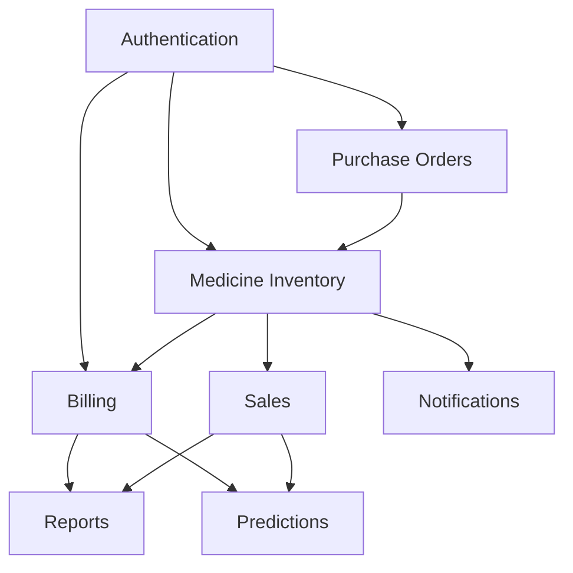

**Explanation:** Forecasting and reporting depend on reliable transactional data from billing and sales. Inventory drives both operational safety and analytics quality.

## 3.6 Acceptance Criteria Snapshot

- Bill creation rejects transactions with insufficient stock.
- Deleting a bill restores stock accurately for all items.
- Receiving PO updates inventory quantities correctly.
- Notification generation avoids uncontrolled duplicates.
- Reports return valid aggregates for selected date ranges.

---

# 4. SYSTEM DESIGN

The system is designed as a modular full-stack platform where each module is a cohesive business capability exposed through API routes and consumed through dedicated frontend components.

## 4.1 Architectural Overview

### Figure 4.1: Overall System Architecture

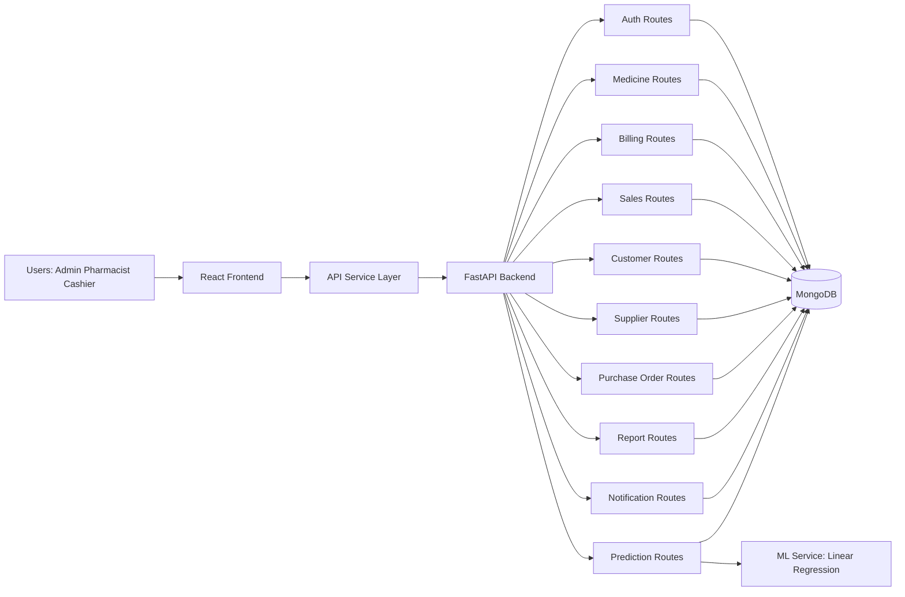

**Explanation:** The architecture separates UI, API, and persistence concerns while enabling independent module evolution.

## 4.2 Backend Design

Backend responsibilities include:

- Data validation through Pydantic models
- Request handling through route modules
- Business logic enforcement (stock checks, status transitions)
- MongoDB operations with async driver
- Aggregation pipelines for reporting

### Figure 4.2: Backend Module Layering

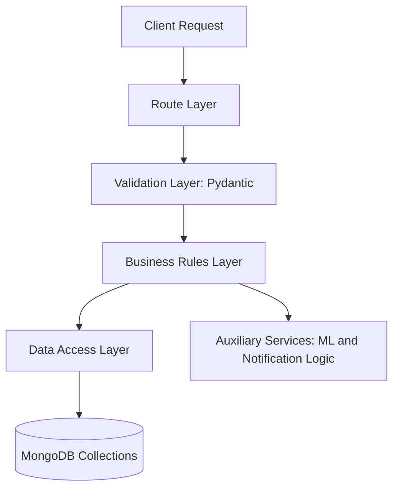

**Explanation:** Layering supports maintainability and reduces accidental coupling between route handlers and low-level data operations.

## 4.3 Data Model and Relationships

Collections include:

- users
- medicines
- sales
- customers
- bills
- suppliers
- purchase_orders
- notifications

### Figure 4.3: Database Entity Relationship Overview

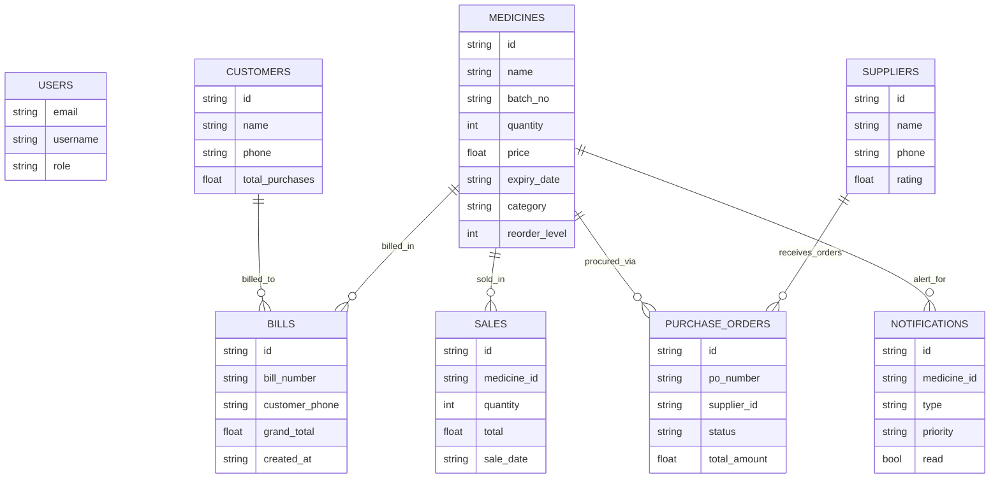

**Explanation:** Some relationships are embedded through item arrays and reference IDs. The design favors operational speed and flexibility.

## 4.4 Authentication and Session Flow

### Figure 4.4: Authentication and Request Flow

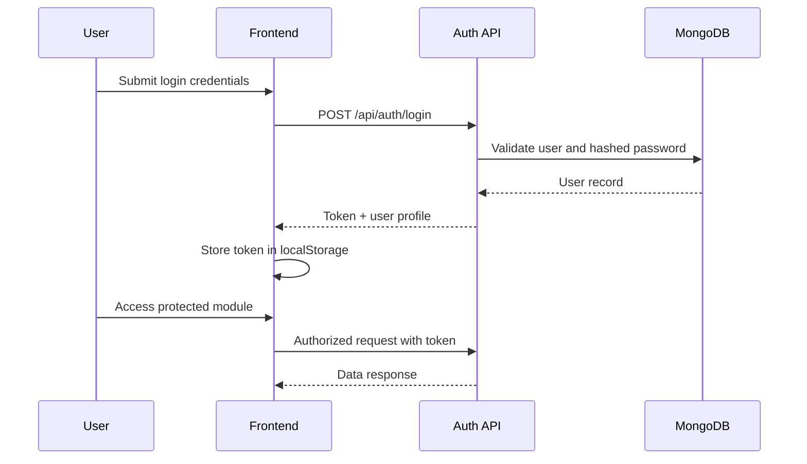

**Explanation:** The current implementation verifies token validity and supports sign-in persistence at the client layer.

## 4.5 Billing and Inventory Synchronization Design

### Figure 4.5: Billing and Stock Synchronization Flow

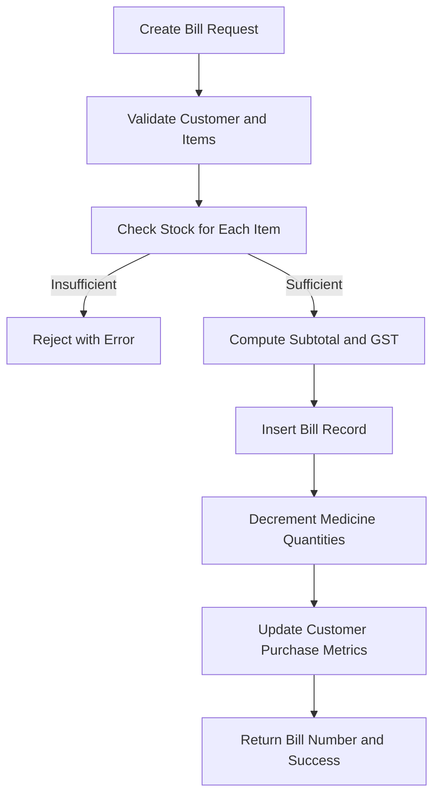

**Explanation:** Stock validation and updates are tightly coupled with bill creation to prevent data drift.

## 4.6 Purchase Order Lifecycle Design

### Figure 4.6: Purchase Order Lifecycle State Diagram

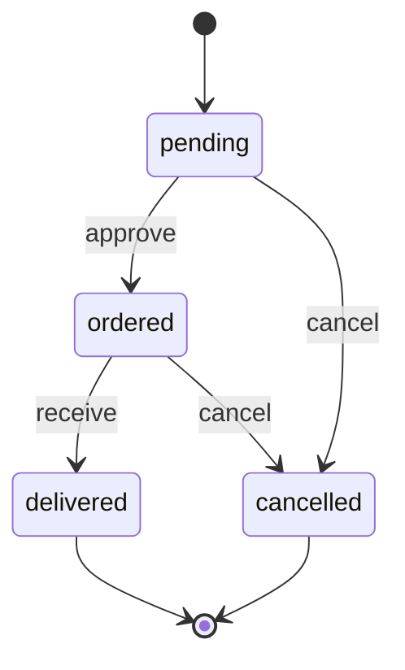

**Explanation:** Controlled transitions provide traceability and reduce status ambiguity.

## 4.7 Notification Design

### Figure 4.7: Notification Generation Pipeline

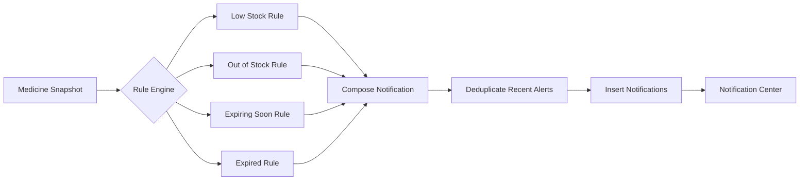

**Explanation:** The deduplication stage avoids repeated noise and alert fatigue.

## 4.8 Demand Forecasting Design

### Figure 4.8: AI Prediction Pipeline

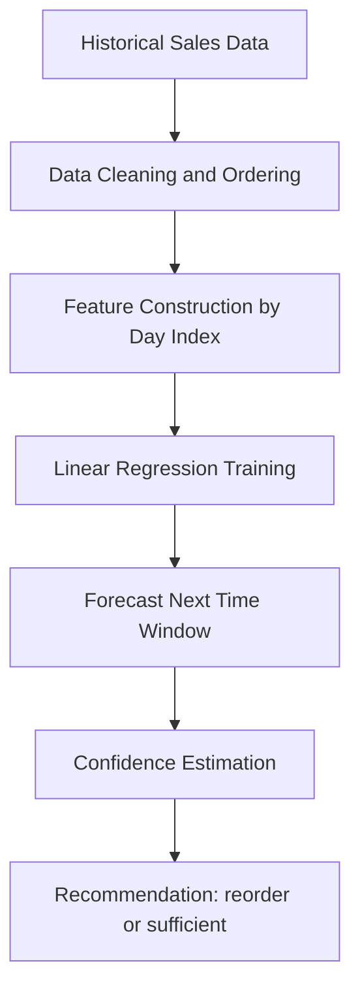

**Explanation:** The forecasting service provides interpretable baseline outputs suitable for operational decision support.

## 4.9 API Design Summary

Core route groups:

- /api/auth
- /api/medicines
- /api/sales
- /api/customers
- /api/billing
- /api/reports
- /api/notifications
- /api/suppliers
- /api/purchase-orders
- /api/predictions

Design characteristics:

- Resource-oriented endpoints
- Clear separation by business domain
- JSON payloads with explicit validation
- Date-range filtering for reports

---

# 5. IMPLEMENTATION METHODOLOGY

The implementation followed an iterative, module-wise approach where core transaction modules were developed first, followed by analytics and support services.

## 5.1 Methodological Approach

1. Requirements and workflow analysis
2. Data model definition and validation contracts
3. Backend route implementation by module
4. Frontend component and navigation implementation
5. Integration of API service layer
6. Testing through scenario-based workflows
7. Containerization and setup automation
8. Documentation and refinement

### Figure 5.1: Development Methodology Timeline

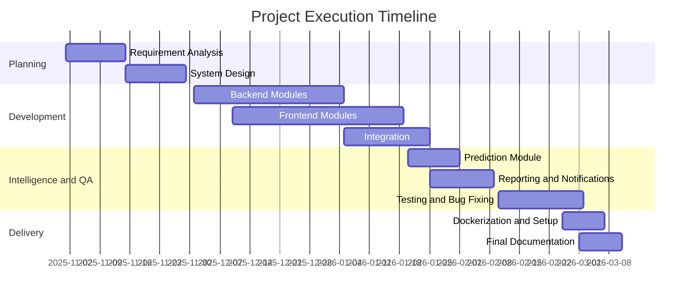

**Explanation:** The timeline reflects layered development with overlapping frontend and backend activities for faster integration.

## 5.2 Backend Implementation Highlights

- FastAPI app initialization with startup/shutdown database lifecycle hooks
- Router-based decomposition for module-level maintainability
- Pydantic schema definitions for robust input contracts
- Business rule checks in write endpoints (stock, status transitions, uniqueness)
- Aggregation queries for reports and statistics

## 5.3 Frontend Implementation Highlights

- Single-page application structure with module-driven navigation
- Reusable API service methods for all backend interactions
- Dashboard visualizations for quick KPI interpretation
- Forms and tables designed for high-frequency pharmacy operations
- Notification center and chatbot for user assistance

### Figure 5.2: Frontend Navigation and Component Hierarchy

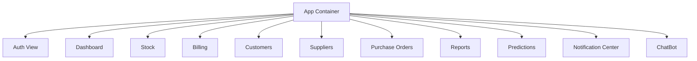

**Explanation:** The hierarchy maps operational modules to distinct user-focused components.

## 5.4 API Integration Strategy

The frontend communicates through a centralized API utility that exposes module-specific methods. This design:

- Avoids scattered fetch logic
- Standardizes error handling
- Simplifies base URL and token management
- Enables faster feature extension

### Figure 5.3: API Route Map

```mermaid
flowchart LR
    A[Frontend API Service] --> B[/auth]
    A --> C[/medicines]
    A --> D[/sales]
    A --> E[/customers]
    A --> F[/billing]
    A --> G[/suppliers]
    A --> H[/purchase-orders]
    A --> I[/notifications]
    A --> J[/reports]
    A --> K[/predictions]
```

**Explanation:** A centralized route map improves consistency and testability.

## 5.5 Data Validation and Error Handling

Validation examples include:

- Mandatory medicine name and batch
- Category checks against allowed category set
- Customer phone uniqueness checks
- Stock sufficiency checks before billing and sale creation
- Valid state transitions for purchase orders

Error handling strategy:

- Return clear HTTP errors with message context
- Preserve request traceability through route-level responses
- Prevent partial business updates for invalid operations

## 5.6 Containerized Deployment Method

Dockerization strategy includes:

- Backend container for FastAPI app
- Frontend container for Vite build/runtime
- MongoDB container as data service
- Docker Compose orchestration for one-command environment setup

Benefits:

- Reproducible demo and testing environment
- Reduced setup friction
- Improved onboarding for evaluators and collaborators

## 5.7 Documentation and Verification Practices

- Endpoint-level testing through API docs
- UI-based scenario validation for transaction workflows
- Migration and verification scripts for PO status updates
- Setup guides and quick-start documents for deployment

---

## 5.1. MODULES OF THE SYSTEM

This subsection details each module with responsibilities, data interactions, and key workflows.

### 5.1.1 Authentication Module

Responsibilities:

- User registration and login
- Token issuance and verification
- Session termination

Inputs/Outputs:

- Input: Email credentials and profile metadata
- Output: Token and role profile for UI access

Critical considerations:

- Password hashing strategy
- Token expiry handling
- Session persistence at frontend

### 5.1.2 Medicine Inventory Module

Responsibilities:

- Medicine master creation and update
- Quantity and reorder-level management
- Expiry monitoring support

Workflow summary:

1. User adds medicine details.
2. System validates category and required fields.
3. Record inserted in medicines collection.
4. Dashboard and stock views refresh with latest status.

### 5.1.3 Sales Module

Responsibilities:

- Capture direct sales records
- Validate stock and update quantity
- Expose aggregated sales summaries

Operational value:

- Rapid transaction logging
- Revenue and quantity visibility
- Foundation data for prediction module

### 5.1.4 Customer Module

Responsibilities:

- Customer record lifecycle management
- Purchase metadata maintenance
- Support recurring customer tracking

Operational value:

- Improved service personalization
- Better customer retention metrics

### 5.1.5 Billing Module

Responsibilities:

- Create itemized bills
- Calculate GST and grand totals
- Synchronize stock and customer statistics

Business significance:

- Revenue traceability
- Tax-aligned bill structure
- Reduced billing errors

### 5.1.6 Supplier Module

Responsibilities:

- Supplier profile and contact maintenance
- Search and active/inactive tracking
- Historical order linkage

Business significance:

- Procurement transparency
- Vendor performance visibility

### 5.1.7 Purchase Order Module

Responsibilities:

- PO creation, update, approval, receiving, cancellation
- Status lifecycle enforcement
- Inventory update on goods receipt

Business significance:

- Controlled replenishment process
- Direct bridge between procurement and inventory

### 5.1.8 Notification Module

Responsibilities:

- Alert generation from stock and expiry conditions
- Read/unread and summary management

Business significance:

- Early risk visibility
- Reduced stock-out and expiry incidents

### 5.1.9 Reports Module

Responsibilities:

- Sales analytics with period-based grouping
- Inventory and customer analysis
- KPI extraction for management decisions

Business significance:

- Evidence-based operational planning
- Better financial tracking and optimization

### 5.1.10 Prediction Module

Responsibilities:

- Learn from historical sales behavior
- Forecast near-term demand
- Recommend reorder actions

Business significance:

- Preventive procurement
- Better working capital management

### 5.1.11 Dashboard and UX Support Module

Responsibilities:

- Consolidate major KPIs and trends
- Offer quick action shortcuts
- Improve operator productivity

Business significance:

- Faster decision cycles
- Better situational awareness

---

# 6. RESULTS AND DISCUSSION

This chapter evaluates implementation outcomes from functional and operational perspectives.

## 6.1 Functional Outcome Summary

All major target modules were implemented and integrated:

- Authentication workflows operational
- Medicine inventory CRUD and status visibility working
- Billing and sales with stock synchronization implemented
- Customer and supplier management functional
- Purchase order lifecycle implemented with receive-based stock updates
- Notification center operational
- Reports and demand prediction integrated

## 6.2 Operational KPI Observations

### Figure 6.1: Dashboard KPI Interpretation Map

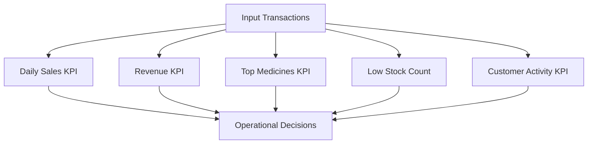

**Explanation:** Dashboard KPIs transform raw transactions into quick operational signals.

## 6.3 Sales Trend Interpretation

### Figure 6.2: Sample Sales Trend Representation


**Explanation:** Trend analysis supports forecasting and season-aware purchase planning.

## 6.4 Business Rule Validation Discussion

### Stock Synchronization

- Bill and sale creation correctly reduce stock
- Bill deletion restores stock as expected
- PO receiving increases stock quantities

### Data Quality

- Validation contracts reduce malformed requests
- Category normalization improves consistency

### Notification Value

- Alert types are actionable and operationally relevant
- Read/unread states support task tracking

## 6.5 User Experience Discussion

Observed usability strengths:

- Module-wise navigation aligns with pharmacy workflows
- Dashboard and quick actions reduce task switching overhead
- Forms and tables provide straightforward data operations

Potential UX improvements:

- Guided onboarding for new operators
- Better keyboard-first operation support
- Inline suggestions from prediction outputs in procurement forms

## 6.6 Analytics and Prediction Discussion

The prediction model currently provides baseline directional support rather than high-fidelity long-horizon forecasting. This is appropriate for initial deployment because:

- It is interpretable and lightweight
- It performs adequately with modest historical data
- It introduces predictive thinking into operational decisions

However, predictive quality can be improved with:

- Seasonality-aware models
- Feature enrichment (promotions, season, day-of-week)
- Continuous model evaluation and retraining pipelines

## 6.7 Risk and Reliability Discussion

Primary risks identified:

- Production security hardening not yet complete
- Forecast sensitivity to sparse sales records
- Need for stronger auditability in regulated settings

Mitigation roadmap:

- Security upgrades (RBAC, JWT, stronger password policies)
- Monitoring and observability integration
- Scheduled data quality checks and archival policies

## 6.8 Comparative Impact Discussion

Compared with basic standalone inventory or billing systems, this integrated platform offers higher business value by unifying transaction management, risk alerting, and analytics in one continuous workflow.

---

# 7. EXPERIMENTAL SETUP

This chapter defines the environment, datasets, validation process, and test strategy used for evaluating the system.

## 7.1 Environment Configuration

### Figure 7.1: Experimental Setup and Environment Matrix

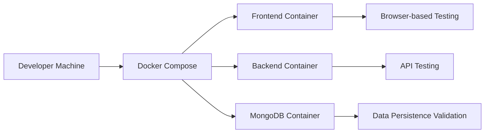

**Explanation:** The same environment supports UI, API, and persistence tests with minimal setup variability.

### Software Environment

- OS: macOS-compatible development and container runtime
- Backend: Python 3.11+, FastAPI, Uvicorn, Motor
- Frontend: Node 16+, React 18, Vite
- Database: MongoDB 7
- Packaging: Docker and Docker Compose

### Hardware Reference Profile

- Multi-core CPU
- Minimum 8 GB RAM
- SSD recommended for smooth container and database performance

## 7.2 Data Setup

Data was initialized through seed scripts creating representative entries for:

- Users with multiple roles
- Medicines across categories
- Customers and suppliers
- Sales and billing records
- Purchase orders and notifications

This provided a controlled baseline for module and integration tests.

## 7.3 Test Strategy

### Figure 7.2: Test Strategy and Coverage Layers

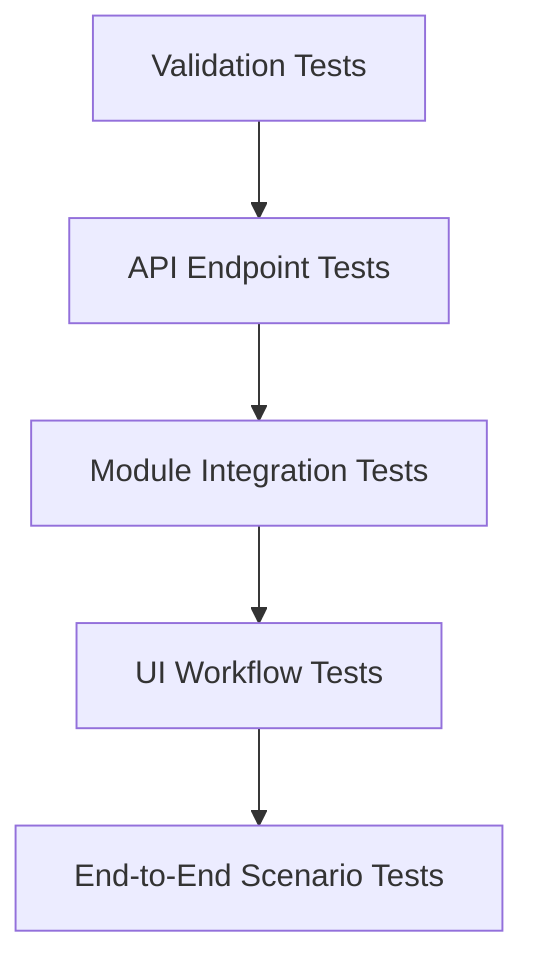

**Explanation:** Layered testing improves confidence from individual constraints to complete business workflows.

## 7.4 Scenario-Based Validation Set

### Scenario S1: Add Medicine and Verify Listing

- Create medicine with valid category and expiry
- Confirm listing and stock status update

### Scenario S2: Create Bill with Multiple Items

- Validate stock before billing
- Confirm bill totals and GST computation
- Confirm stock decrement in medicines collection

### Scenario S3: Delete Bill and Restore Stock

- Delete existing bill
- Confirm corresponding stock restoration per item

### Scenario S4: Purchase Order Receive Workflow

- Create pending PO
- Approve and receive PO
- Validate inventory increments and status transitions

### Scenario S5: Notification Generation

- Configure sample low stock and expiry records
- Trigger notification generation
- Verify alert types and unread counts

### Scenario S6: Demand Prediction

- Ensure sufficient sales history exists
- Fetch prediction results
- Verify recommendation field and confidence outputs

## 7.5 Evaluation Parameters

- Functional correctness of business workflows
- Data integrity across linked modules
- Alert relevance and readability
- Report consistency over date ranges
- Prediction output plausibility

## 7.6 Experimental Limitations

- Performance testing under very high concurrency not covered in current scope
- Long-term forecasting evaluation limited by historical data size
- Security penetration testing not part of initial academic cycle

---

# 8. CONCLUSION AND FUTURE WORK

## 8.1 Conclusion

The Pharmacy Management System successfully demonstrates an integrated and practical software solution for modern pharmacy operations. It combines transactional reliability and operational intelligence within a modular, maintainable architecture. Core objectives were met across authentication, inventory, billing, customer and supplier management, purchase order workflows, notification alerts, reports, and demand forecasting.

The strongest contribution of this project is not any single feature, but the interoperability of modules. Billing affects stock, stock influences alerts, transactions feed reports, and sales history powers predictions. This connected design enables better decision-making and reduces operational blind spots common in fragmented systems.

The technology stack proved suitable for rapid development and maintainability:

- FastAPI provided high development velocity and structured APIs
- MongoDB enabled flexible but robust data handling
- React and Tailwind supported responsive and productive interfaces
- Docker improved reproducibility and deployment simplicity

Overall, the project meets both academic expectations and practical deployment feasibility for pharmacy digital transformation.

## 8.2 Future Work

### Security and Governance

- Migrate to bcrypt/Argon2 password hashing
- Introduce JWT with refresh-token strategy
- Enforce route-level RBAC by role
- Add audit logs and immutable transaction trails

### Data and Intelligence

- Upgrade forecasting to ARIMA/Prophet/LSTM hybrid approaches
- Add seasonal and event-based features
- Build automated model retraining and drift detection

### Product and UX Enhancements

- Add barcode/QR scanning for faster medicine lookup
- Add multi-branch inventory transfer workflows
- Introduce recommendation prompts inside purchase order forms
- Add invoice PDF generation and archival storage

### Reliability and Operations

- Add caching and index optimization for report-heavy workloads
- Implement structured monitoring and alert observability
- Add automated backups and disaster recovery workflow

### Interoperability

- Integrate payment gateways for digital billing closure
- Add accounting export connectors (CSV/ERP APIs)
- Enable optional e-prescription integration in compliant settings

### Figure 8.1: Future Roadmap Progression

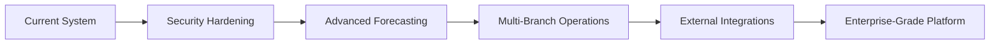

**Explanation:** The roadmap shows staged growth from strong prototype to production-grade platform.

---

# APPENDIX A: DETAILED API INVENTORY

## A.1 Authentication APIs

- POST /api/auth/signup
- POST /api/auth/login
- POST /api/auth/logout
- GET /api/auth/verify/{token}

## A.2 Medicine APIs

- POST /api/medicines/
- GET /api/medicines/
- GET /api/medicines/expiring
- GET /api/medicines/categories
- PUT /api/medicines/{medicine_id}
- DELETE /api/medicines/{medicine_id}

## A.3 Sales APIs

- POST /api/sales/
- GET /api/sales/
- GET /api/sales/summary

## A.4 Customer APIs

- POST /api/customers/
- GET /api/customers/
- GET /api/customers/{customer_id}
- PUT /api/customers/{customer_id}
- DELETE /api/customers/{customer_id}
- GET /api/customers/stats/summary

## A.5 Billing APIs

- POST /api/billing/
- GET /api/billing/
- GET /api/billing/{bill_id}
- DELETE /api/billing/{bill_id}
- GET /api/billing/stats/summary

## A.6 Supplier APIs

- GET /api/suppliers/
- GET /api/suppliers/{supplier_id}
- POST /api/suppliers/
- PUT /api/suppliers/{supplier_id}
- DELETE /api/suppliers/{supplier_id}
- GET /api/suppliers/{supplier_id}/history

## A.7 Purchase Order APIs

- GET /api/purchase-orders/
- GET /api/purchase-orders/{po_id}
- POST /api/purchase-orders/
- PUT /api/purchase-orders/{po_id}
- PUT /api/purchase-orders/{po_id}/approve
- PUT /api/purchase-orders/{po_id}/receive
- PUT /api/purchase-orders/{po_id}/cancel
- DELETE /api/purchase-orders/{po_id}
- GET /api/purchase-orders/summary/statistics

## A.8 Notification APIs

- GET /api/notifications/
- GET /api/notifications/unread-count
- POST /api/notifications/generate
- PUT /api/notifications/{id}/read
- PUT /api/notifications/mark-all-read
- DELETE /api/notifications/{id}
- DELETE /api/notifications/clear-all
- GET /api/notifications/summary

## A.9 Reports APIs

- GET /api/reports/sales
- GET /api/reports/inventory
- GET /api/reports/customers

## A.10 Prediction API

- GET /api/predictions/

---

# APPENDIX B: SAMPLE TEST CASES

| Test ID | Module | Scenario | Expected Result |
|---|---|---|---|
| TC-01 | Auth | Valid login | Token and user profile returned |
| TC-02 | Auth | Invalid login | Error response with invalid credentials |
| TC-03 | Inventory | Add medicine with empty name | Validation error |
| TC-04 | Billing | Bill with insufficient stock | Request rejected |
| TC-05 | Billing | Valid multi-item bill | Bill created and stock decremented |
| TC-06 | Billing | Delete bill | Stock restored |
| TC-07 | PO | Approve pending PO | Status changes to ordered |
| TC-08 | PO | Receive ordered PO | Status delivered and stock incremented |
| TC-09 | Notifications | Generate alerts | Alert records created by rule |
| TC-10 | Reports | Sales report by date | Aggregated metrics returned |
| TC-11 | Predictions | Fetch demand predictions | Demand values and recommendations returned |
| TC-12 | Suppliers | Delete supplier with history | Soft delete or guarded behavior |

---

# APPENDIX C: EXTENDED DISCUSSION FOR LONG-FORM SUBMISSION

This appendix provides additional explanatory prose intended for thesis-length formatting and detailed viva preparation.

## C.1 Why Integrated Pharmacy Software Matters

A pharmacy is an operationally dense environment where multiple workflows overlap continuously: incoming stock, point-of-sale transactions, customer support, prescription interpretation, supplier communication, compliance needs, and end-of-day reconciliation. If each workflow is tracked in separate systems, delays and inconsistencies become inevitable. The present system addresses this by reducing context switching and synchronizing data updates at source events.

In practical terms, this means a bill is not just a document but a stock event, a customer event, and a reporting event. Similarly, receiving a purchase order is not only procurement closure but also inventory replenishment and future sales-readiness improvement. Such unified thinking is central to resilient pharmacy management.

## C.2 Design Trade-offs and Justifications

### MongoDB as Data Store

Using MongoDB allows quick schema adaptation for evolving modules, especially in academic and pilot deployment settings. Embedded arrays in bills and purchase orders simplify read paths for UI rendering while preserving key references.

### FastAPI for Backend

FastAPI was selected for its speed, typed contracts, and built-in API documentation support. This makes route testing and team onboarding more efficient.

### React for Frontend

React component composition enables module-level UI ownership, making it easier to extend each business capability without destabilizing the full application.

### Baseline ML Model

Linear regression was used to keep prediction outputs interpretable and computationally lightweight. In environments with limited data maturity, model transparency is often more valuable than premature model complexity.

## C.3 Sustainability Perspective

Inventory waste is an economic and social problem. Medicines that expire before sale represent both financial loss and avoidable resource consumption. By combining expiry awareness with demand-linked planning, the project contributes to a more sustainable retail-health model.

## C.4 Practical Deployment Guidance

For real deployment pilots, recommended steps are:

1. Enforce secure credential and secret management.
2. Switch to production-grade auth and access control.
3. Add regular backups and restore drills.
4. Monitor top failure points and latency hotspots.
5. Conduct role-specific training with SOP-based onboarding.

## C.5 Suggested Viva Questions and Talking Points

- Why did you choose document-oriented storage for this use case?
- How do you prevent stock inconsistency across billing and PO modules?
- What are the limitations of linear regression in demand forecasting?
- How does the notification module avoid repetitive alerts?
- What changes are needed to deploy this system in production hospitals?

## C.6 Extended Conclusion for Academic Evaluation

This project demonstrates how a practical software system can unify core operations and analytical insight in a high-impact healthcare retail context. The implementation reflects sound engineering choices under realistic constraints while leaving a clear roadmap for production maturity. Its modular architecture, operational completeness, and decision-support orientation make it a strong foundation for both academic demonstration and real-world pilot adaptation.

---

# END OF REPORT
